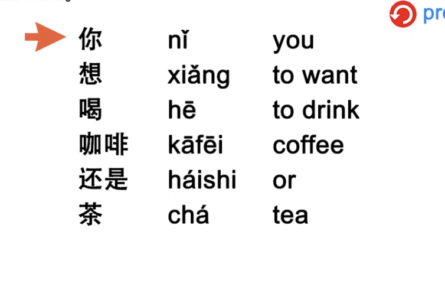
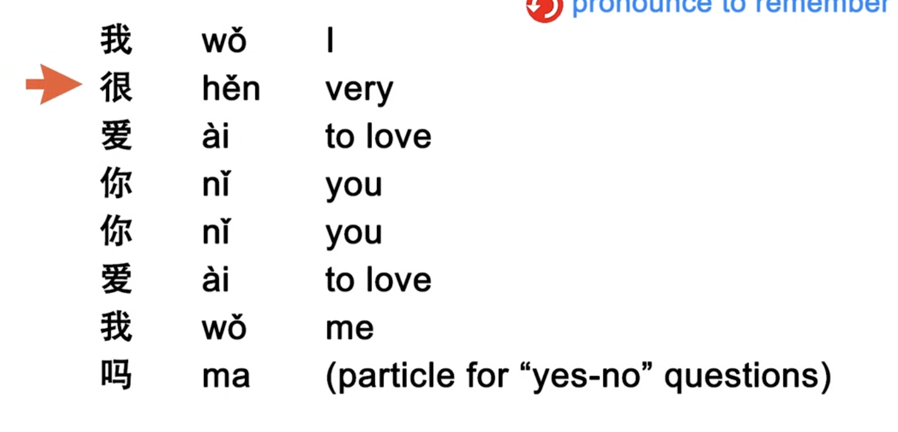
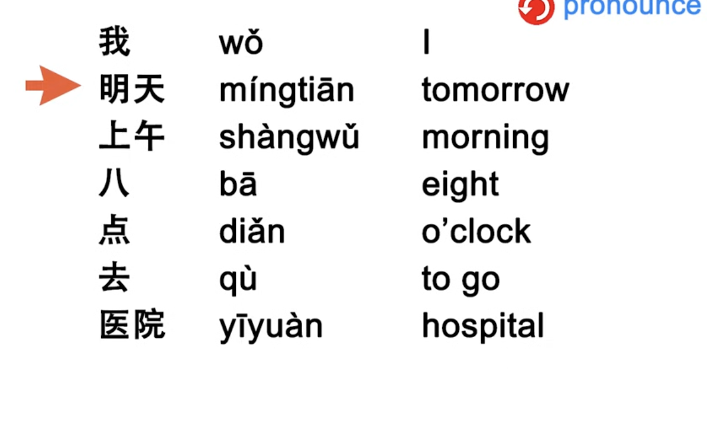
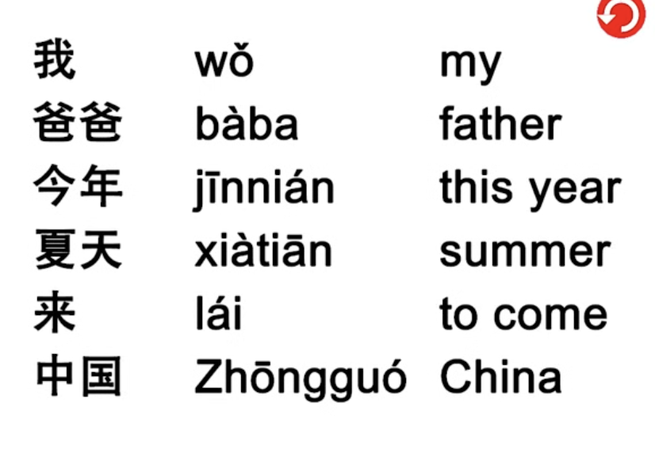
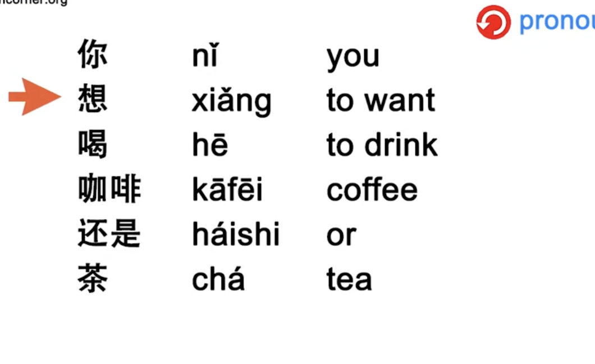
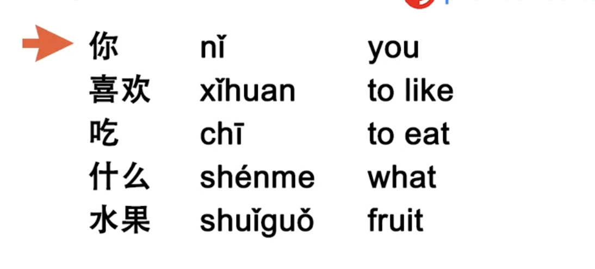
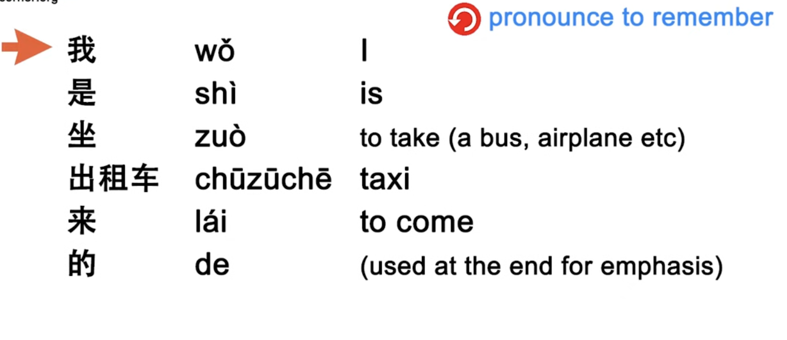
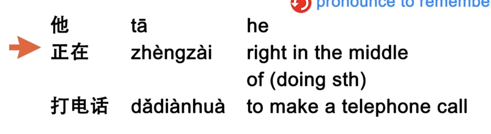

https://www.youtube.com/watch?v=mfBwNIjMbss&list=PL7VdqFXO0Lzdu2U1q-_vZxcuWyqJEitZV 

----- 

----- 

-----

 

 

 ---- 

 

 

 ---- 

 

 ---- 

 HSK 1 
 - Literal translations are provided to understand each word
 - Repeat these words --> Try to translate everything you say in english into chinese
 - Start thinking in Chinese

 ---- 

- ài
    - verb: to love 
    - example: 

- bā
    - 8 
    - example: 

- bàba
    - noun: father
    - example: 

Stage setting - In english you would state what hapeend first, then add where and when. Chinese words first set the stage by putting the time and place beofre the action.

- běn
    - measure: for books

- bùkèqui
    - you're welcome don't mention it
    - example 

- chá
    - noun: tea
    - example: 

- chī
    - verb: to eat
    - example: 

- chūzūzchē
    - noun: taxi
    - example: 

- dǎdiànhuà
    - to make a phone call
    - example: 
    